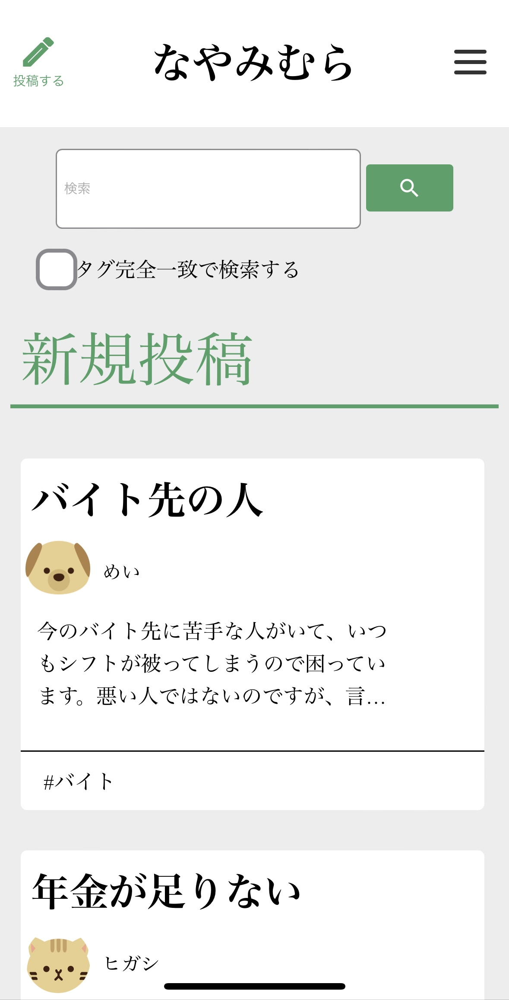
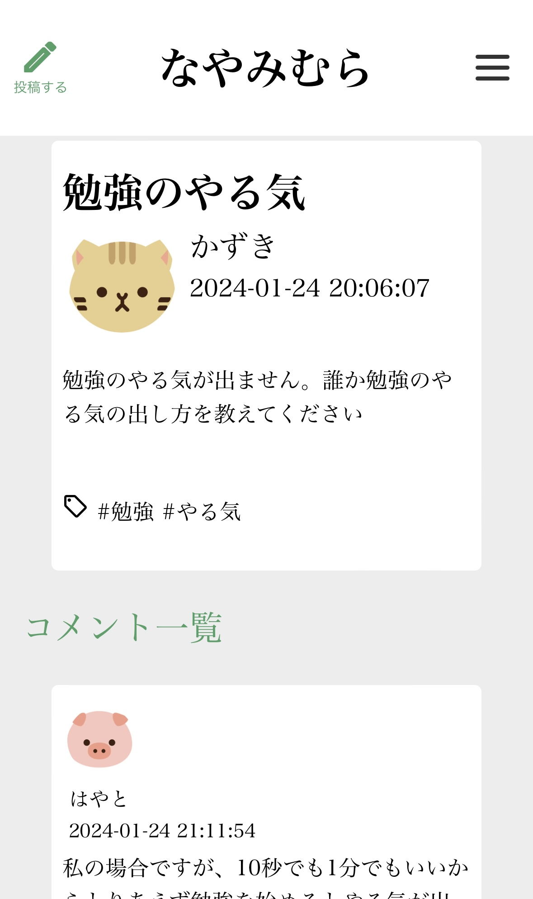
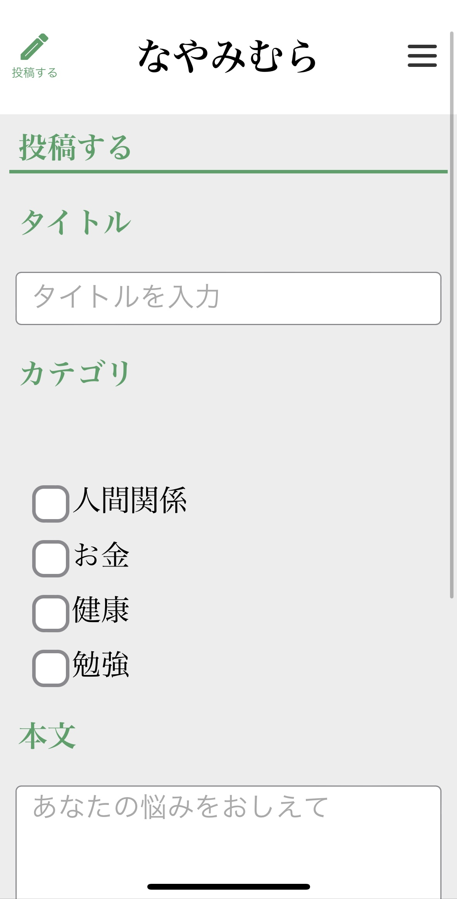

# なやみむら
専門学校2年後期で作成したWebアプリです。3人チームで作成しています。

 

## アプリ概要
気軽に悩みを投稿する掲示板型のWebアプリです。投稿に自分の悩みに合ったタグをつけて投稿することで、そのタグを使ったことがある人だけがコメントできるようになります。

 

## 使用技術
- HTML/CSS
- JavaScript
- PHP
- MySQL

 

## 担当場所
一覧表示機能、マイページ表示機能、画面UIを担当しました。

 

## エピソード
これまでのアプリ開発の経験から、チーム間のコミュニケーションを意識しました。WBSで進捗状況を共有したり、作業に詰まった箇所をすぐに相談することで、スムーズに開発を進めることができました。

 

## アプリ画面
最新の投稿が一覧で表示されます。投稿の検索もできます。

投稿の詳細画面です。使用したタグの使用履歴がある人のみコメントできます。

投稿画面です。

